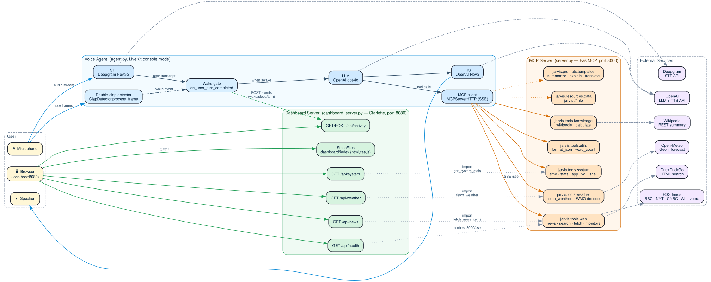

# rizvis

> An Iron Man-style voice assistant. **Wake word + double-clap activation**, a
> **FastMCP** tool server, an **OpenAI gpt-4o** brain, **Deepgram** ears, an
> **OpenAI Nova** voice, and a live **Iron-Man HUD dashboard** that polls real
> data instead of faking it.

```
double-clap  ──►  "Systems online, boss. What do you need?"
"hey jarvis" ──►   ↳ asks the world news → speaks 3-sentence brief → opens monitor
                   ↳ asks weather        → hits Open-Meteo via MCP   → reports it
                   ↳ asks system status  → reads live psutil stats   → reports it
"go to sleep" ──► "Standing by, boss."
```

---

## What is it actually doing?

Three cooperating processes on localhost:

| Port | Process                    | What it does                                                                                  |
|------|----------------------------|-----------------------------------------------------------------------------------------------|
| —    | **Voice Agent** (`agent.py`) | Grabs your mic, runs the STT→LLM→TTS pipeline, calls MCP tools, handles wake/sleep state.   |
| 8000 | **MCP Server** (`server.py`) | FastMCP over SSE. Exposes 16 tools + 3 prompts + 1 resource to the LLM.                     |
| 8080 | **Dashboard Server** (`dashboard_server.py`) | Starlette. Serves the HUD static files and JSON endpoints that share code with the MCP tools. |

The voice agent fires-and-forgets activity events (wake / sleep / user-turn) to
the dashboard, so the HUD's activity log shows what J.A.R.V.I.S. is doing in
real time.

---

## Architecture

[Graphviz source](docs/architecture.dot) · [PNG](docs/architecture.png) · [SVG](docs/architecture.svg)



**Reading the diagram:**

- Solid blue arrows = the audio path (mic → STT → LLM → TTS → speaker).
- Solid orange arrows = the LLM calling MCP tools over SSE.
- Solid green arrows = the browser pulling JSON from the dashboard backend.
- Dotted gray arrows = in-process imports (the dashboard backend reuses
  `jarvis.tools.*` directly — no duplication).
- Dashed gray arrows = external egress (Deepgram, OpenAI, RSS, Open-Meteo, etc.).
- Dashed green arrow (`wake → /api/activity`) = the voice agent posts events to
  the dashboard so the activity log is live.

To regenerate the diagram after editing the DOT source:

```bash
dot -Tsvg docs/architecture.dot -o docs/architecture.svg
dot -Tpng docs/architecture.dot -o docs/architecture.png
```

---

## Quick Start

```bash
# 1. Install dependencies (uv handles Python + deps in one go)
uv sync

# 2. Set up API keys
cp .env.example .env
# Edit .env with real keys for: LIVEKIT, OPENAI, DEEPGRAM
# (GOOGLE_API_KEY is only needed if you switch LLM_PROVIDER back to "gemini")

# 3. Launch everything (MCP + dashboard + voice agent)
./start.sh
```

`start.sh` will:

1. Free ports 8000 and 8080.
2. Boot the MCP server on `:8000` (background, log at `/tmp/jarvis_mcp.log`).
3. Boot the dashboard server on `:8080` (background, log at `/tmp/jarvis_dashboard.log`).
4. Open the HUD in your default browser.
5. Run the voice agent in **console mode** — i.e. it grabs your laptop mic
   directly, no LiveKit room needed.

Say **"Wake up Jarvis"** or **double-clap** to activate. Say **"Go to sleep"**
(or just wait 2 minutes) to deactivate. `Ctrl+C` shuts everything down cleanly
via the `start.sh` trap.

### Running pieces individually

```bash
uv run jarvis            # MCP server only        (port 8000)
uv run jarvis_dashboard  # Dashboard only         (port 8080)
uv run jarvis_voice      # Voice agent only       (laptop mic, console mode)
uv run jarvis_cloud      # Voice agent — LiveKit Cloud playground mode
```

---

## Configuration

Everything goes in `.env` (see [.env.example](.env.example) for the template):

| Variable              | Required for                   | Where to get it                                  |
|-----------------------|--------------------------------|--------------------------------------------------|
| `LIVEKIT_URL`         | LiveKit Cloud mode             | https://cloud.livekit.io                         |
| `LIVEKIT_API_KEY`     | LiveKit Cloud mode             | same                                             |
| `LIVEKIT_API_SECRET`  | LiveKit Cloud mode             | same                                             |
| `OPENAI_API_KEY`      | LLM (gpt-4o) + TTS (Nova)      | https://platform.openai.com/api-keys             |
| `DEEPGRAM_API_KEY`    | STT (Nova-2)                   | https://console.deepgram.com                     |
| `GOOGLE_API_KEY`      | Only if `LLM_PROVIDER="gemini"`| https://aistudio.google.com/apikey               |
| `SERVER_NAME`         | Optional — MCP server name     | default `J.A.R.V.I.S.`                           |
| `DEBUG`               | Optional                       | default `false`                                  |

**Provider selection** is in [`agent.py`](agent.py) at the top:

```python
STT_PROVIDER = "deepgram"   # or "whisper"
LLM_PROVIDER = "openai"     # or "gemini"
TTS_PROVIDER = "openai"
```

> ⚠️ Free-tier Gemini 2.5 Flash is **20 requests/day** and 5 RPM — fine for
> exploring the code, painful for a real voice loop. Default is `"openai"`.

---

## Wake-Up

Two ways to activate while J.A.R.V.I.S. is in standby:

### 1. Voice wake-word

Any of these phrases trigger wake (see [`WAKE_PHRASES`](agent.py)):

> wake up jarvis · hey jarvis · jarvis wake up · yo jarvis · jarvis · hello
> jarvis · good morning jarvis · activate jarvis

The wake check runs inside `on_user_turn_completed` — if you're sleeping and
the transcript doesn't match a wake phrase, the LLM turn is **cleared** so it
never burns an API call.

### 2. Double-clap

A custom RMS-energy detector ([`ClapDetector`](agent.py)) runs in parallel with
STT on the raw audio frames. Two transients 0.1–0.6 seconds apart trigger a
wake. The detector is **active only while sleeping** so you can clap during a
conversation without triggering anything.

### Sleep

Sleep phrases: "go to sleep", "stand down", "goodnight jarvis", "that's all
jarvis", "shut down". Or just wait **2 minutes** for auto-sleep.

On wake, J.A.R.V.I.S. plays one of 7 hardcoded TTS greetings (no LLM call —
saves quota, and sidesteps Gemini's "function call must follow a user turn"
rule when waking from a clap).

---

## Tools Reference

The MCP server exposes **16 tools**, **3 prompts**, **1 resource**.

### Tools

| Tool                   | Type      | Description                                                  |
|------------------------|-----------|--------------------------------------------------------------|
| `get_world_news`       | web       | Aggregated headlines (BBC, NYT, CNBC, Al Jazeera) via RSS    |
| `get_finance_news`     | web       | Market headlines (CNBC, MarketWatch, NYT Business)           |
| `search_web`           | web       | DuckDuckGo HTML search                                       |
| `fetch_url`            | web       | First 4000 chars of any URL                                  |
| `open_world_monitor`   | web       | Opens `worldmonitor.app` in your browser                     |
| `open_finance_monitor` | web       | Opens `finance.worldmonitor.app`                             |
| `get_weather`          | weather   | Open-Meteo geocode + forecast (no API key needed)            |
| `get_current_time`     | system    | Current date/time                                            |
| `get_system_info`      | system    | CPU / RAM / disk via `psutil`                                |
| `open_application`     | system    | `open -a <name>` for macOS apps                              |
| `set_volume`           | system    | `osascript` system-volume control                            |
| `run_shell_command`    | system    | Run a read-only shell command (substring blocklist)          |
| `wikipedia_summary`    | knowledge | Wikipedia REST summary lookup                                |
| `calculate`            | knowledge | Safe AST-based math evaluator                                |
| `format_json`          | utils     | Pretty-print a JSON string                                   |
| `word_count`           | utils     | Words / characters / lines                                   |

### Prompts (`jarvis/prompts/templates.py`)

- `summarize(text)` — concise summary template
- `explain_code(code, language="Python")` — step-by-step code explainer
- `translate(text, target_language="Spanish")` — translation template

### Resources

- `jarvis://info` — short server descriptor.

---

## HUD Dashboard API

The dashboard backend at `:8080` re-uses the MCP tool functions in-process — no
duplicated logic.

| Endpoint                            | Returns                                          |
|-------------------------------------|--------------------------------------------------|
| `GET /`                             | Serves [`dashboard/index.html`](dashboard/index.html) |
| `GET /api/system`                   | `psutil` stats (cpu_percent, ram_percent, …)     |
| `GET /api/news?type=world\|finance` | List of `{source, title, summary, link, published}` |
| `GET /api/weather?city=...`         | Open-Meteo current weather, structured           |
| `GET /api/health`                   | `{dashboard, mcp}` — probes `:8000/sse`          |
| `GET /api/activity`                 | Most-recent 50 activity events                   |
| `POST /api/activity`                | `{message, kind?}` — voice agent posts here      |

The HUD JS polls these endpoints on a tiered schedule:

- system every 5s, health every 5s, activity every 4s
- news every 5min, weather every 10min

Each card has a graceful failure path — if the backend is down, the card shows
`OFFLINE` instead of breaking.

---

## Project Structure

```
.
├── agent.py                  # LiveKit voice agent (wake gate + clap detector)
├── server.py                 # FastMCP server entry point
├── dashboard_server.py       # Starlette dashboard backend
├── start.sh                  # One-click launcher
│
├── jarvis/                   # MCP-side Python package
│   ├── config.py
│   ├── prompts/templates.py  # MCP prompt templates
│   ├── resources/data.py     # MCP resources
│   └── tools/
│       ├── web.py            # news, search, fetch_url, monitors
│       ├── system.py         # time, system stats, app, volume, shell
│       ├── weather.py        # Open-Meteo via fetch_weather()
│       ├── knowledge.py      # Wikipedia + calculate
│       └── utils.py          # format_json + word_count
│
├── dashboard/                # Static HUD (served at :8080)
│   ├── index.html
│   ├── index.css             # Iron-Man HUD styling
│   └── index.js              # polls /api/* endpoints
│
├── docs/
│   ├── architecture.dot      # Graphviz source
│   ├── architecture.svg
│   └── architecture.png
│
├── pyproject.toml            # uv-managed deps + entry-point scripts
├── .env.example              # config template (commit this)
└── .env                      # real keys (NEVER commit — gitignored)
```

### Shared-helpers refactor

The MCP tools were originally defined inside `register(mcp)` closures, which
meant the dashboard backend would have had to duplicate every fetcher. The
current layout extracts the actual data work into **module-level helpers**:

- `jarvis.tools.web.fetch_news_items(feeds, limit)` — used by both
  `get_world_news` / `get_finance_news` and `/api/news`.
- `jarvis.tools.system.get_system_stats()` — used by `get_system_info` and
  `/api/system`.
- `jarvis.tools.weather.fetch_weather(city)` — used by `get_weather` and
  `/api/weather`.

So when the HUD asks for live data, you're hitting the **same code path** the
LLM uses when it calls a tool — single source of truth.

---

## Development

### Tail the logs

```bash
tail -f /tmp/jarvis_mcp.log
tail -f /tmp/jarvis_dashboard.log
```

### Swap the LLM provider

```python
# agent.py
LLM_PROVIDER = "gemini"   # or "openai"
GEMINI_LLM_MODEL = "gemini-2.5-flash"
OPENAI_LLM_MODEL = "gpt-4o"
```

### Swap the STT provider

```python
STT_PROVIDER = "deepgram"   # or "whisper"
```

### Add a new tool

1. Add an `async def` (or sync `def`) to one of `jarvis/tools/*.py`.
2. Register it inside that module's `register(mcp)` with `@mcp.tool()`.
3. Restart the MCP server — the LLM picks it up on next connect.

If the tool fetches data the HUD should display, expose a module-level helper
(see "Shared-helpers refactor" above) and add a JSON endpoint in
`dashboard_server.py`.

---

## Known Trade-offs

These are real, but were deliberate scope decisions, not oversights:

- **`run_shell_command` is not a sandbox.** It has a substring blocklist
  (`rm`, `sudo`, etc.) which is bypassable. Treat it as "convenience for the
  owner", not "safe for an untrusted prompt".
- **`fetch_url` has no SSRF guard.** It will happily fetch `localhost` /
  `169.254.169.254`. Don't expose the MCP server beyond loopback as-is.
- **The double-clap detector is energy-based**, not ML. Loud single sounds
  with a quick echo can occasionally false-trigger.
- **Free-tier Gemini is 20 requests/day.** Default LLM is OpenAI for that
  reason — see configuration above.

---

## License

MIT.
